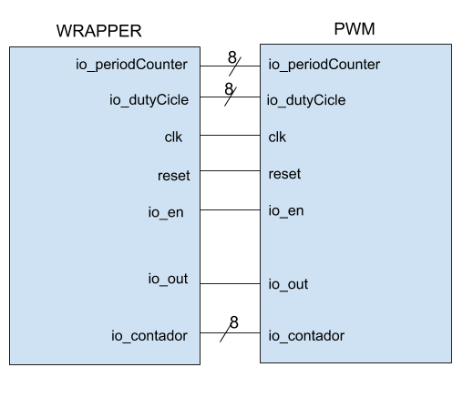

# Formal Verification

## a. Descripción de la verificación realizada.
La verificación se realizó para ambas pruebas, con un total de pasos de 20 y motores de verifereicacion: boolector, yices y z3.
``` depth 20 
    [engines]
    smtbmc boolector
    smtbmc yices
    smtbmc z3
```
### 1. bounded module check:
Salida de la verificacion formal:
```
SBY 21:01:32 [taller2] engine_0: ##   0:00:02  Checking assertions in step 12..
SBY 21:01:32 [taller2] engine_1: ##   0:00:02  Status: passed
SBY 21:01:32 [taller2] engine_1: finished (returncode=0)
SBY 21:01:32 [taller2] engine_1: Status returned by engine: pass
SBY 21:01:32 [taller2] engine_0: terminating process
SBY 21:01:32 [taller2] engine_2: terminating process
SBY 21:01:32 [taller2] summary: Elapsed clock time [H:MM:SS (secs)]: 0:00:06 (6)
SBY 21:01:32 [taller2] summary: Elapsed process time [H:MM:SS (secs)]: 0:00:02 (2)
SBY 21:01:32 [taller2] summary: engine_1 (smtbmc yices) returned pass
SBY 21:01:32 [taller2] DONE (PASS, rc=1)
```
Se observa, para un total de 20 pasos el engine_1 termina primero, en la cual esta referenciado con el motor yices.

### 2. k-induction:
Salida de la verificación formal:
```
SBY 21:15:49 [taller2] engine_1.basecase: ##   0:00:03  Checking assertions in step 19..
SBY 21:15:49 [taller2] engine_1.basecase: ##   0:00:03  Status: passed
SBY 21:15:49 [taller2] engine_0.basecase: ##   0:00:03  Checking assumptions in step 13..
SBY 21:15:49 [taller2] engine_1.basecase: finished (returncode=0)
SBY 21:15:49 [taller2] engine_1: Status returned by engine for basecase: pass
SBY 21:15:49 [taller2] engine_0.basecase: terminating process
SBY 21:15:49 [taller2] engine_2.basecase: terminating process
SBY 21:15:49 [taller2] summary: Elapsed clock time [H:MM:SS (secs)]: 0:00:05 (5)
SBY 21:15:49 [taller2] summary: Elapsed process time [H:MM:SS (secs)]: 0:00:02 (2)
SBY 21:15:49 [taller2] summary: engine_1 (smtbmc yices) returned pass for induction
SBY 21:15:49 [taller2] summary: engine_1 (smtbmc yices) returned pass for basecase
SBY 21:15:49 [taller2] summary: successful proof by k-induction.
SBY 21:15:49 [taller2] DONE (PASS, rc=1)
```
a diferencia de la prueba con bmc, k-induction se toma 1 segundo de mas.

## b. Diagrama de bloques explicativo.


## C. Reglas Formales 

|  | assume | assert |
| --- | --- | --- |
| 0. Inicialmente el circuito tiene que estar con un reset. | [x] | [ ] |
| 1. Se asume que el periodo es mayor a 0 | `assume (io_periodCounter > 0)` *Este assume aplica para todo el formal verification* | | 
| 2. Se asume que el duty Cicle es menor al periodo y mayor a 0.| `assume (io_dutyCicle<io_periodCounter);assume (io_dutyCicle>0);`*Este assume aplica para todo el formal verification*|  | 
| 3. Si el reset esta en alto, el contador debe ser 0. |  | `if (reset) begin assert (io_contador == 0); end` |
| 4. Si el enable está en 0, la salida debe ser 0.  | | `if (!io_en)begin assert (io_out == 0); end` |
| 5. Si el contador es mayor a 0, y menor o igual al duty Cicle, la salida debe ser 1, asumiendo que el enable esta activo.| `assume (io_en);` *Este assume aplica solo para esta assertion*| `if(io_contador <= io_dutyCicle && io_contador>0)begin assert (io_out == 1); end`|
| 6. Si el contador es mayor al duty Cicle, y menor o igual al periodo, la salida debe ser 0, asumiendo que el enable está activo.| `assume (io_en);` *Este assume aplica solo para esta assertion*| `if (io_contador>io_dutyCicle && io_contador<= io_periodCounter)begin assert (io_out == 0); end` |
| 7. Si el contador es mayor a 1, el contador debe ser igual al pasado del contador+1. *(Lo que se busca verificar es que el contador siempre vaya sumando de a 1)*|`assume(io_en);`*Este assume aplica solo para esta assertion*|` if(io_contador>8'h1)begin assert (io_contador==$past(io_contador)+1'b1); end` |

### Más detalles de algunas reglas formales:
1. Este assume es para no mirar los casos en que se ingrese un periodo negativo, ya que asumimos que siempre se ingresan valores correctos por simplicidad del circuito.
2. Este assume es para no mirar cuando se ingrese un duty Cicle mayor al periodo, ya que esto no es posible y asumimos que siempre se ingresan valores correctos.
/7. Aca la condicion es que el contador sea mayor a 1, ya que cuando el contador es igual a 0, quiere decir que el reset está activado, por lo cual no nos interesa esta condición, y cuando el contador es igual al periodo, el contador se reinicia a 1, por lo cual cuando el contador es igual a 1, no nos interesa que esta condición se cumpla.
